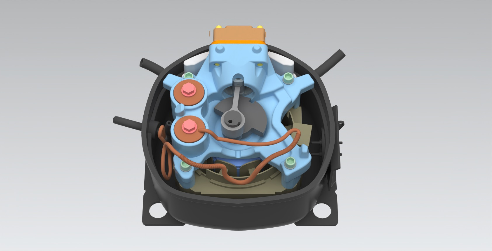
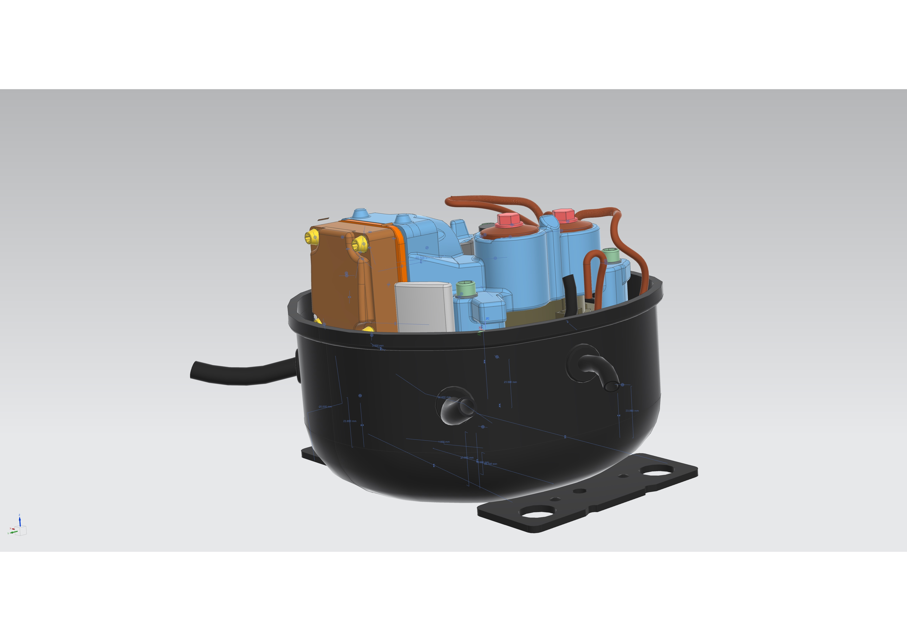
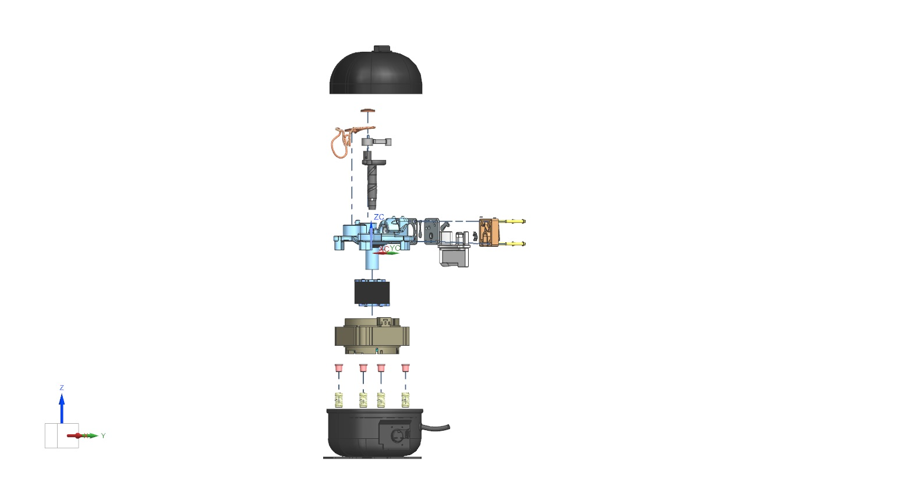

# CAD Compressor Project

## Introduction
This project encompasses the modeling of a reciprocating compressor derived from a refrigerator, that was performed for the design course.

## Disassembly
Dimensions were measured using a digital caliper, with larger or smaller components measured using alternative methods. Disassembly challenges were overcome with assistance from the Engineering workshop.

## Exploded View
The object comprises 26 unique parts, escalating to 35 with subassemblies, totaling 46 parts. The actual assembly file includes all modeled parts.

## Part Comparisons and NX Commands
Highlighting pivotal parts and various commands utilized in their creation or constraints in sub-assemblies. New features like Sheet Metal Model, Spline, and Sweep Along Guide were learned.

## Drafting and Tolerances
Drafting is crucial for the piston, with assigned tolerances ensuring its free movement while maintaining a leak-proof fit and precise cylindrical shape.

## Finite Element Analysis (FEA)
A FEA was conducted to simulate stress on the piston, indicating the piston's safety under specified pressure conditions.

## Conclusion
The project necessitated creative solutions, proficiency in various NX commands, improved teamwork, and enhanced time management skills.

---

**Project by:** Hakancan Ozturk, the contribution of the group members are not disclosed in this repo, yet the parts without my contributions were left out.
**License:** [See here](./LICENSE)  
**Project Report:** [MECH203 Project Report.docx](./MECH203%20Project%20Report.docx)  
**Presentation:** [Mech 203 - Final Project Group 4_ Reciprocating Compressor.pptx](./Mech%20203%20-%20Final%20Project%20Group%204_%20Reciprocating%20Compressor.pptx)  
**Videos:** [Assembly Sequence](./Videos/Assembly%20Sequence.mp4), [Disassembly Video](./Videos/Disaseembly%20Video.mp4), [Motion Video](./Videos/Motion%20Video.mp4)  
